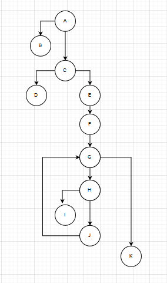

# SI_lab2_183137
# Леонид Стојковски, бр. на индекс 183137

Група на код:
CheckPrime

* Control Flow Graph

* Цикломатска комплексност

	Цикломатската комплексност на овој код е 3, истата ја добив преку пресметуванје на бројот на предикантни јазли + 1

* Ќе ги користам истите тест случаи за двата критериума

	Имаме вкупно 6 тест случаи за овој критериум 

	За тест случај 1 ги имаме следниве променливи 
				
		n=-1

	За тест случај 2 ги имаме следниве променливи 

		n=0

	За тест случај 3 ги имаме следниве променливи 

		n=2

	За тест случај 4 ги имаме следниве променливи 

		n=4

* Објаснување на напишаните unit tests

	EVERY PATH 

		За тест случај 1 имаме вредност на n=-1  во случајот е негативна па првиот услов е исполнет и ќе се добие одговор  "Number should not be negative", односно ќе се изврши патеката А-B

		За тест случај 2 имаме вредност на n=0 во случајот услов за дали n==0 || n==1 е исполнет и ќе се добие одговор  "FALSE", односно ќе се изврши патеката АC-D

		За тест случај 3 имаме вредност на n=2  во случајот овој број е прост па затоа условот внатре во for-от n%i==0 е точен и ќе се добие одговор  "TRUE", односно ќе се изврши патеката АCEFGH-I

		За тест случај 4 имаме вредност на n=4  во случајот овој број е не е прост број па условот внатре во for-от n%i==0 нема никогаш да се исполни па ќе се добие одговор  "FALSE", односно ќе се изврши патеката ACEFGHIJG-K

	EVERY STATEMENT 

		За тест случај 1 имаме вредност на n=-1  во случајот е негативна па првиот услов е исполнет и ќе се добие одговор  "Number should not be negative" .
		
		За тест случај 2 имаме вредност на n=0 во случајот услов за дали n==0 || n==1 е исполнет и ќе се добие одговор  false.

		За тест случај 3 имаме вредност на n=2  во случајот овој број е прост па затоа условот внатре во for-от е точен и ќе се добие одговор  true.

		За тест случај 4 имаме вредност на n=4  во случајот овој број е не е прост број па условот внатре во for-от нема никогаш да се исполни па ќе се добие одговор  false